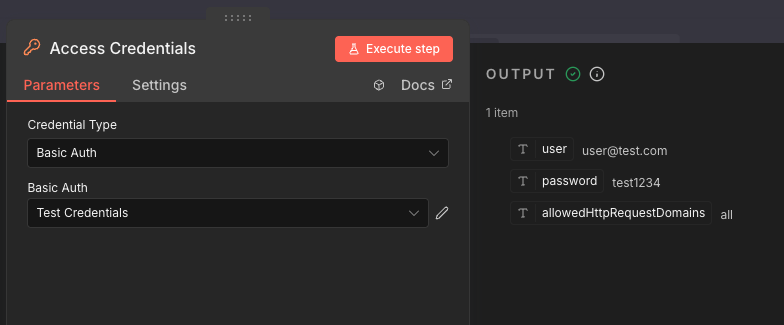

# n8n-nodes-access-credentials

This is an n8n community node that allows you to access and decode credentials directly in your workflow.

The **Access Credentials** node reads the credentials you assign to it and outputs them as JSON data, making credential values available to downstream nodes.



[n8n](https://n8n.io/) is a [fair-code licensed](https://docs.n8n.io/reference/license/) workflow automation platform.

## Installation

Follow the [installation guide](https://docs.n8n.io/integrations/community-nodes/installation/) in the n8n community nodes documentation.

## How It Works

The node supports **every credential type** available in your n8n instance — API keys, OAuth1/OAuth2 tokens, database credentials, service-specific credentials, and any other type. No hardcoded list: all credential types appear dynamically in the dropdown.

## Usage

1. Add the **Access Credentials** node to your workflow
2. Select the **Credential Type** from the dropdown
3. Select the specific credential instance
4. Execute the node — it outputs the credential fields as JSON

The node passes one output item per input item, each containing the decoded credential data.

## Development

```bash
npm install
npm run build
npm run lint
npm test
```

## Compatibility

- Requires n8n version 1.0.0 or later

## License

[MIT](LICENSE.md)
